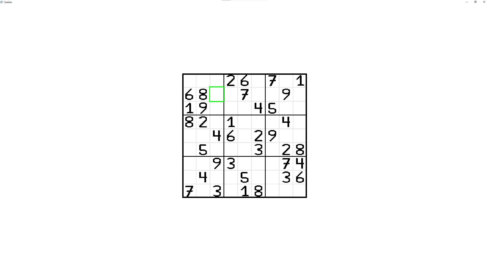
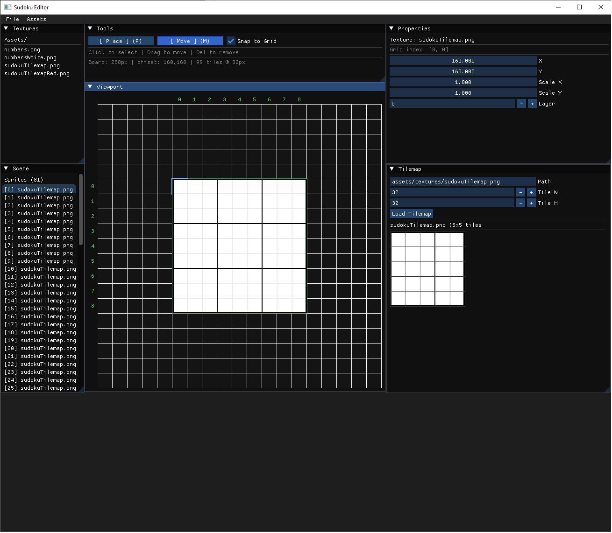

# Sudoku in SFML

This is a simple Sudoku game built with Simple and Fast Multimedia Library (SFML).

This project and [the MemorySDL](https://github.com/f1sch/MemorySDL) are small experiments where I
explore game Development without using a game engine.

And of course, just for fun.

All assets were created by me.

## Features

- Custom rendering using SFML (no game engine)
- Texture atlas / sprite sheet based rendering
- Tile-based board system (9x9 grid)
- Separation of game logic and rendering
- Basic scene system

## Tools

- C++
- SFML
- ImGui (for the tilemap editor)
- Aseprite (for all assets)

## Motivation

The goal of this project was to better understand low-level game development concepts like rendering, 
asset management, and tool creation without relying on a game engine.
***

## Tilemap editor

A simple custom tilemap editor built with ImGui.

It allows loading spritesheets and creating tilemaps, which are then used directly in the game.

In this project, it was used to build the Sudoku board and UI.

The viewport represents the virtual resolution.

It can also be used to place UI elements and prototype different scenes.

### License
The source code is open source, but all game assets (art, audio, music) are proprietary and may not be reused.