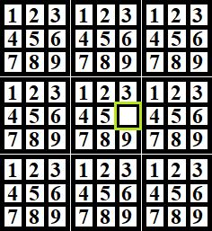

# Sudoku

## Systeme in der Reihenfolge der Implementierung
1. GameManager - Erstellt und verbindet alle Systeme
2. Game Loop - orchestriert einen Frame (Input -> Logik -> Render). Keine Entscheidungsgewalt
3. AssetManager - lädt und cached alle Texturen einmal beim Start
4. Renderer - flusht die RenderQueue jedes Frame (reine Darstellung)
5. SceneManager - verwaltet die aktive Szene
6. GridSystem - definiert Bildschirmkoordinaten für Zellen
7. Board - Daten und Spiellogik
8. InputSystem - verarbeitet Maus und Tastatur
9. SudokuGenerator - generiert ein gültiges Puzzle
10. SudokuSolver - löst ein Brett, Werkzeug des Generators (und des Auto-Complete)

## Ablauf eines Frames
1. Input
   1. Input Events werden in einer Queue gespeichert
   2. Queue wird zu Beginn eines Frames überprüft
2. Logik
   1. Reagiert auf Veränderungen des Zustands (z.B. Input)
   2. Updated den Zustand des Spiels
3. Render
   1. RenderQueue wird jedes Frame neu mit RenderObjects befüllt
   2. RenderQueue wird durchlaufen und alle enthaltenen RenderObjects werden gerendert
   

## GameScene als Brücke
Die GameScene kennt die Daten von Gridsystem, Board, Cells und die Positionen.
Sie erstellt die RenderObjects, die an den Renderer weiter gegeben werden.

Daraus ergibt sich:

GameScene -> Simulation

Renderer -> View

## Gamedesgin
### MockUp des Spielbretts


Der grüne Rahmen zeigt die momentane Auswahl einer Zelle.
In einer ausgewählten Zelle kann mit der Tastatur eine Zahl eingetragen werden.

Die Maus soll nicht verfügbar sein im Spiel.
Jegliche Auswahl soll über die Tastatur passieren.
Das bedeutet, dass feste Punkte auf dem Bildschirm definiert sind, die eine 
Auswahl ermöglichen.
Der Cursor springt dann zwischen diesen Punkten hin und her.

## Implementierungsdetails
### Zellen Struct 
Die grundlegende Datensruktur für eine einzelne Zelle des Boards.

```
struct Cell
{
    int number;
    std::set<int> note;
    bool canEdit;
}
```

### Zeichnen der GameScene
Das Spielfeld wird jedes Frame gezeichnet.
Es ist ein Rahmen mit vertikalen und horizontalen Linien.
Die Texturen für die Zellen werden dann bei Bedarf über das Spielfeld gezeichnet.
Das betrifft die Zellen, die eine Zahl beinhalten.